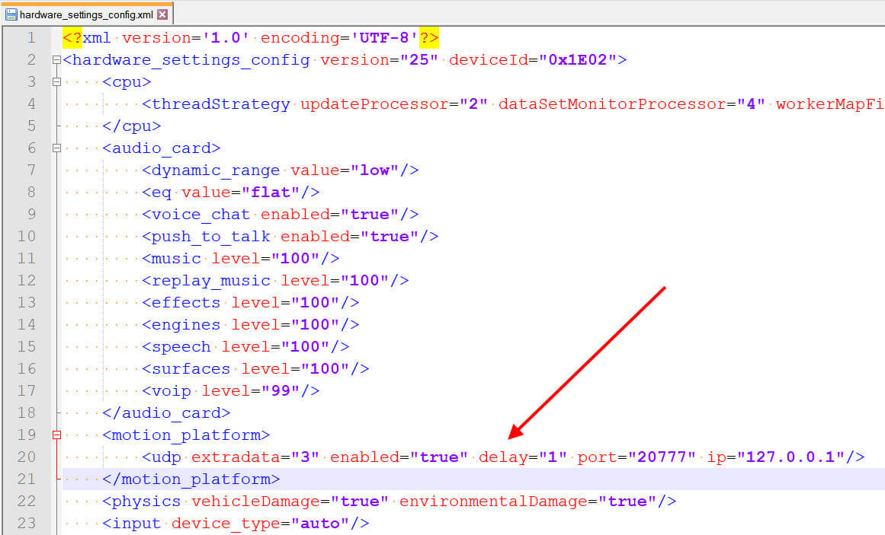

# Dirt Rally 2.0 Logging

## Introduction
\
This repo holds scripts to export Dirt Rally 2.0 telemetry data from the game, through SimHub and into a CSV file. The flow for the information is as follows; Dirt Rally 2.0 exports the game over UDP to 127.0.0.1:20777, SimHub injests the data from 127.0.0.1:20777 and fowards the data to 127.0.0.1:20778, and then the python script injests the data from 127.0.0.1:20778 and dumps it to a CSV in the users Documents\DirtRally2Logs folder.\
\
The reason for the forwarding in SimHub is because only one program can injest data from a UDP port at a time. We need SimHub for other uses like LCD displays and motion controllers so it needs the data without any delay. SimHub then forwards the data from the game to the port our python script is listening on so we can log the data to a CSV.\
\
SimHub will automatically launch the python script when a race starts and close the script after the game stops. All of this will happen in the background so there will be no indication of logging. The script may take up to 10 seconds to close after the race ends so don't try to open the CSV right away otherwise you may lose data from the end of the race.

## Requirements
\
This software requires SimHub and python3 in order to run. The links for this software can be found below:

- https://www.python.org/downloads/
- https://www.simhubdash.com/download-2/

Note that SimHub is a one time paid software.

## Getting Started - Python
\
This program requires Python 3.7+ in order to run. As such it will require the following modules (all of which should come pre-installed).

- socket - Used to read from the UDP socket in the game
- threading - Used to keep the tkinter window open and still allow logging
- os - Used to put the logs inside of a 'DirtRally2Logs' folder
- datetime - Used to put the date and time after each logging folder
- struct - Used to decode the binary string the game exports

## Getting Started - Dirt Rally 2.0

To enable logging inside of Dirt you will need to follow the steps below. I followed [this](https://motionsystems.eu/2020/03/dirt-udp-proxy-fana-leds-2/) guide to figure out what needed to be done. 

1) Go to Documents\My Games\DiRT Rally 2.0\hardwaresettings
2) Open hardware_settings_config.xml in notepad
3) Under the <motion_platform> XML section change:\
 **&lt;udp enabled="false" extradata="1" ip="127.0.0.1" port="20777" delay="1" /&gt;**\
 to:\
 **&lt;udp enabled="true" extradata="3" ip="127.0.0.1" port="20777" delay="1" /&gt;**\
 \
 

## Getting Started - SimHub
\
There is a decent amount of configuration that needs to be done in order to get SimHub working with this python script.

1) Copy the python files to the install path of SimHub

2) Open SimHub
3) Open the game config for Dirt Rally 2.0 under the Games window of SimHub

4) Change the game config to allow UDP forwarding to 127.0.0.1:20778

5) Go down to the controls and events tab under the Events section

6) Create 2 new mappings for GameStarted (Run_logging_start.pyw) and GameStopped (Run_logging_stop.pyw)

7) Restart SimHub
